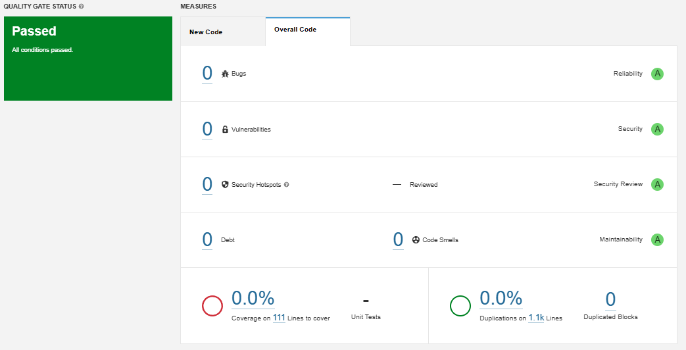
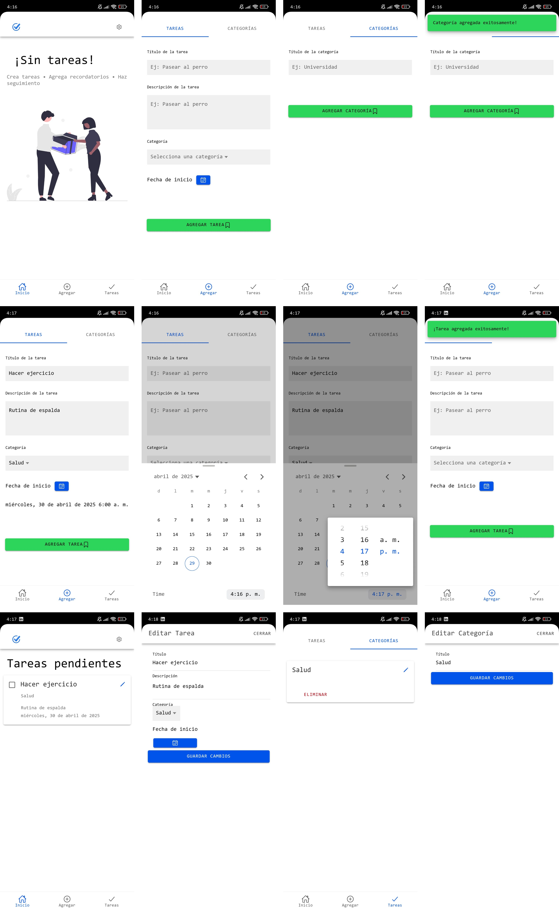
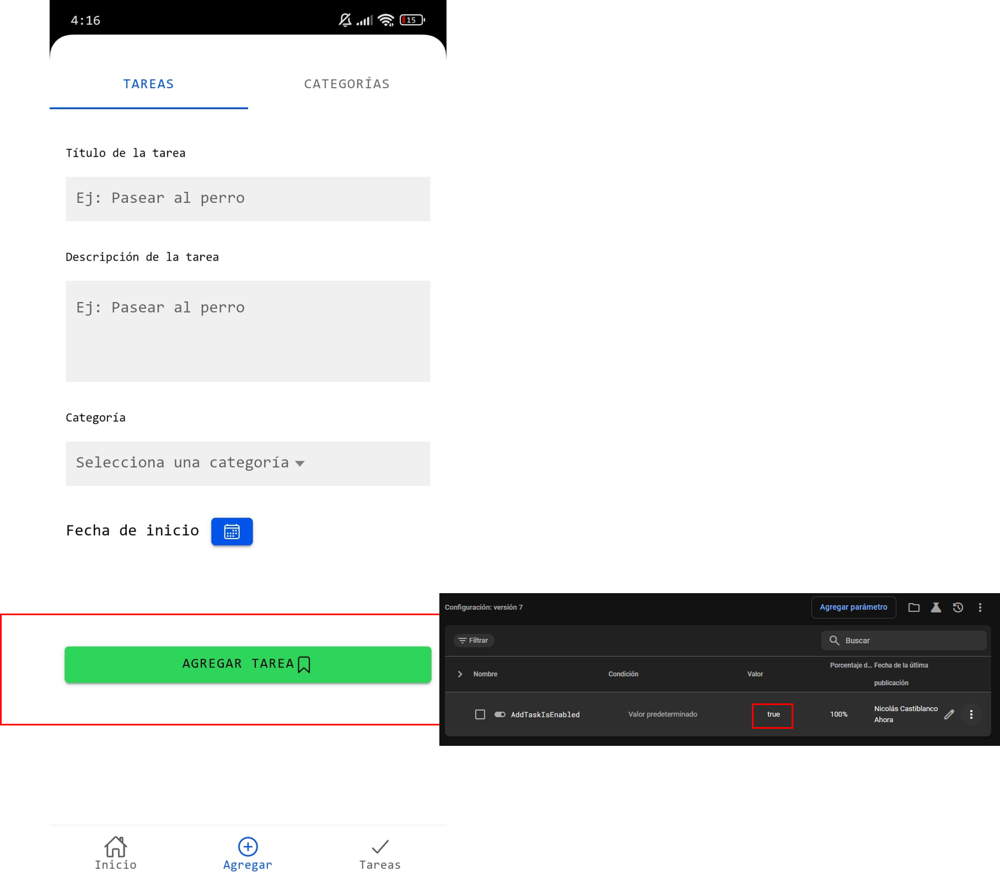
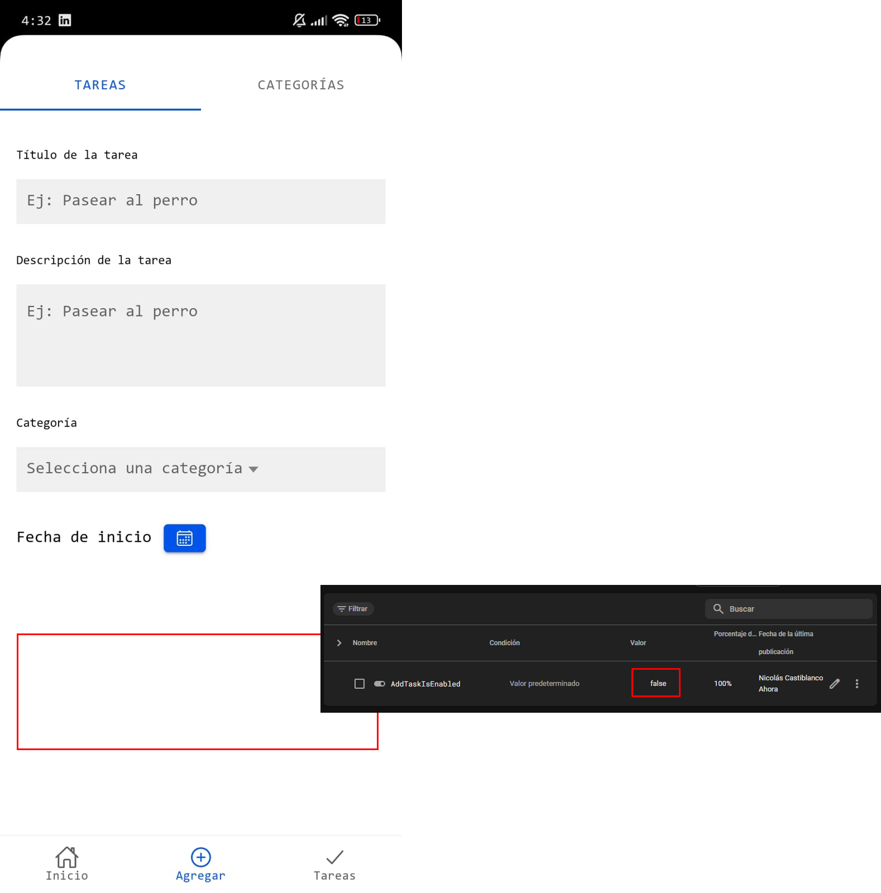

# Prueba Técnica para Desarrollador Mobile - Aplicación Ionic

## 📱 Descripción General

Esta es una prueba técnica desarrollada con **Ionic + Angular**, cuyo objetivo es demostrar habilidades en el desarrollo de aplicaciones móviles híbridas. Se construyó una **aplicación de lista de tareas (To-Do List)** que permite:

- Agregar nuevas tareas  
- Marcar tareas como completadas  
- Eliminar tareas  
- Categorizar tareas (crear, editar, eliminar categorías)  
- Filtrar tareas por categoría

Se utilizaron buenas prácticas de desarrollo, optimización de rendimiento y configuración para múltiples plataformas móviles.

---

## ⚠️ Nota Importante: Capacitor en lugar de Cordova

A partir de **Ionic v4**, el framework dejó de usar Cordova como motor por defecto para las funcionalidades nativas y lo reemplazó por **Capacitor**, una solución moderna, más integrada y mantenida activamente por el equipo de Ionic. Actualmente, Ionic se encuentra en la v8

Por esta razón, **esta aplicación utiliza Capacitor** para compilar y ejecutar en Android, en lugar de Cordova.

Adicionalmente, el proyecto está configurado para compilar **exclusivamente en android**, ya que no dispongo de un equipo MAC para hacer el respectivo build en xcode.

---

## 🚀 Funcionalidades

- To-Do List con almacenamiento local  
- Gestión de categorías y tareas (Ver, Crear, Actualizar y Eliminar)  
- Filtro por categoría  
- Integración con Firebase + Remote Config para feature flags  
- Optimización de rendimiento (carga inicial, uso eficiente de memoria)  
- Exportación de APK e IPA para pruebas
- Diseño amigable con el usuario

---

## 🚨 Pre-Requisitos

- Java JDK 21
- Android Studio
- Ionic CLI
- SonarQube (Opcional)

---

## 🔧 Tecnologías Utilizadas

- Ionic Framework  
- Angular  
- Capacitor  
- Firebase + Remote Config  
- TypeScript

---

## ⚙️ Instalación y Ejecución

### 1. Clonar el repositorio e instalar paquetes

```bash
git clone https://github.com/n1colasc/todo-list
cd todo-list
npm install
```
### 2. Ejecutar en navegador (modo desarrollo)
```bash
npm run start
```
### 3. Preparar plataformas móviles
```bash
npm run build:android // Este comando compila web, limpia y sincroniza android y procede a generar la APK.
```

## 🧪 Calidad del Código

El proyecto fue analizado con SonarQube para asegurar un código limpio, mantenible y libre de errores comunes.
La mayoría del código está documentado adecuadamente para facilitar su comprensión y mantenimiento por parte de otros desarrolladores.

## 📦 Exportación

Se generaron archivos .apk para Android, listo para pruebas.

## 📁 Estructura del Repositorio
```bash
src/app/
├── components/           # Componentes reutilizables
│   ├── edit-category-modal/  # Modal para editar categorías
│   ├── edit-task-modal/      # Modal para editar tareas
│   └── menu/                 # Componente de menú
├── models/              # Interfaces y modelos de datos
│   ├── task.model.ts    # Modelo de tarea
│   └── category.model.ts # Modelo de categoría
├── pages/              # Páginas principales de la aplicación
│   ├── home/           # Página principal
│   ├── tasks/          # Lista de tareas
│   ├── add-task/       # Crear nueva tarea
│   └── settings/       # Configuraciones
└── services/           # Servicios de la aplicación
    ├── data.service.ts        # Servicio de gestión de datos
    └── remote-config.service.ts # Servicio de configuración remota
```

## Modelos de Datos

### Task
```typescript
interface Task {
    id: number;
    title: string;
    description: string;
    date: string;
    completed: boolean;
    categoryId?: number;
}
```

### Category
```typescript
interface Category {
    id: number;
    name: string;
}
```

## Servicios

### DataService
Servicio principal para la gestión de datos que maneja:
- Almacenamiento local de tareas y categorías
- Operaciones CRUD para tareas y categorías
- Persistencia de datos usando localStorage

Métodos principales:
- `addTask(task: Task)`: Agrega una nueva tarea
- `toggleTask(task: Task)`: Alterna el estado de completado de una tarea
- `deleteTask(task: Task)`: Elimina una tarea
- `addCategory(category: Category)`: Agrega una nueva categoría
- `deleteCategory(category: Category)`: Elimina una categoría
- `updateTask(updatedTask: Task)`: Actualiza una tarea existente
- `updateCategory(updatedCategory: Category)`: Actualiza una categoría existente

### RemoteConfigService
Servicio para manejar configuraciones remotas de la aplicación.

---

## 📸 Demostraciones

### Estado del análisis del SonarQube

### Diseño y funcionamiento de la aplicación

### Funcionamiento de firebase remote config
#### Flag activo

#### Flag inactivo


### Nota:
- En la ruta ./docs/apk se encuentra el archivo generado para android con nombre **todo-list.apk**.

---

### 

## ❓ Preguntas

### ¿Cuáles fueron los principales desafíos que enfrentaste al implementar las nuevas funcionalidades?

- Inicialmente, el desconocimiento de nunca haber trabajado con ionic y que hace mucho no usaba Angular fue todo un reto.
- El intentar integrar cordova en ionic fue otro dolor de cabeza, ya que de manera explicita Ionic instala capacitor de manera predeterminada, sin embargo, en lo que pude investigar, ambos compiladores se comportan de manera similar. Incluso los plugins de Cordova sirven en Capacitor.

### ¿Qué técnicas de optimización de rendimiento aplicaste y por qué?

- Lazy loading de módulos > Ayuda a un renderizadi óptimo de componentes.
- Uso de trackBy en listas > Para listas muy grandes trackBy ayuda a pasar un id único en vez de que Angular tenga que analizar objetos completos.
- Almacenamiento eficiente en localStorage > Es una integración normal, no tiene mayor ciencia.

### ¿Cómo aseguraste la calidad y mantenibilidad del código?

- Revisión con SonarQube
- Uso de principios SOLID
- Estructura del proyecto bien definida
- Documentación interna y tipado estricto con TypeScript.
